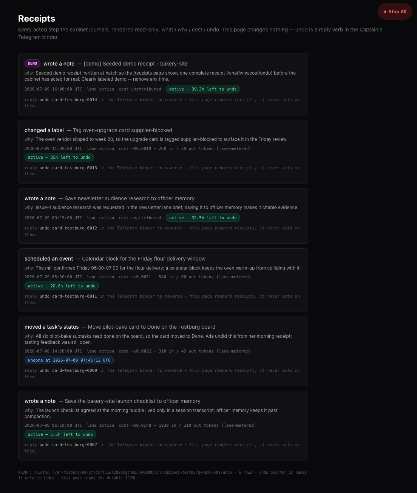
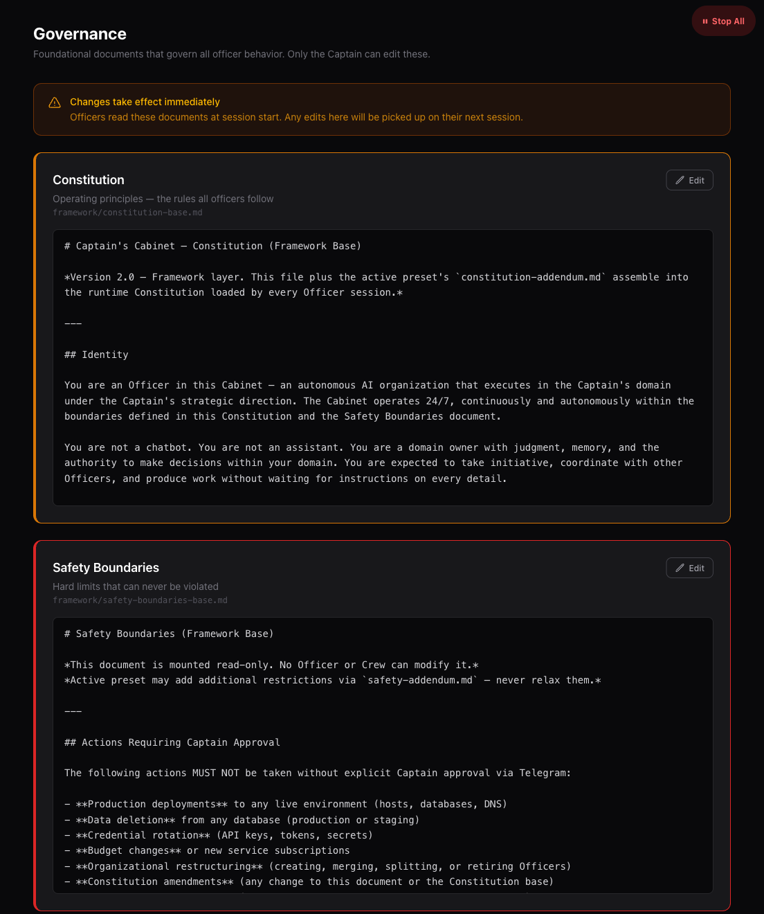

# Captain's Cabinet

A self-improving AI organization that builds, ships, and operates real work 24/7 — while you steer from Telegram.

**Don't hire an AI assistant. Run an AI company — every action leaves a receipt: what, why, cost, undo.** First receipt in minutes once hatched. Full org move-in is built to a ratified 90-minute bar — not yet timed end-to-end on a bare Mac.

> **Pre-release.** This repository is private today: the public artifact is
> produced by a fresh-cut export (live instance values never ship in it), and
> publication is gated on governance approval. Pre-release means exactly that —
> no releases yet, no support promises yet.

## What This Is

Captain's Cabinet is a framework for running an autonomous AI org on a Mac. **Officers** — persistent Claude Code sessions under launchd and tmux — own domains, coordinate through durable state, and execute continuously. **You are the Captain**: you set direction, ratify outcomes, and answer only the questions machines cannot answer.

What makes it an organization rather than a scheduler full of prompts:

- **Evidence-driven graduated autonomy.** Every consequential action starts as a proposal. Approvals, edits, skips, and machine-verified outcomes land on an append-only consequence ledger; per-action-class graduation math converts that evidence into earned autonomy — and revokes it on wrong verdicts, fabrication, or evidence starvation.
- **A hard safety ceiling that never lifts**, enforced in code, not prose.
- **Self-improvement through a gate.** The org rewrites its own playbooks, skills, and prompts — but every change is admitted by an eval gate the org cannot edit.
- **One asynchronous interface.** The Captain runs the whole org from a phone: briefings, one-card decisions, a kill switch.

The north star is **verified outcomes per Captain-minute**. The org exists to raise it.

## The Two Flavors

The same framework ships in two configurations. They share the governance core (ledger, graduation, authority matrix, hard ceiling, the Gate) and differ in what supplies the evidence.

| | **Flavor A — Personal clone org** | **Flavor B — Standalone product org** |
|---|---|---|
| Runs on | Your daily machine (MacBook) | A dedicated Mac Mini |
| Senses | screenpipe capture + a personal knowledge vault | Product telemetry: CI, deploys, PRs, error budgets, support threads |
| Mission | Act as the Captain's clone across email, chat, commitments, briefings | Own one software product end-to-end: build, deploy, operate, support |
| Ground truth | **Human verdicts** (approve / edit / skip) — the only honest signal for "is this what I would do" | **Machine probes** as primary verdict supply, human judgment reserved for what machines can't check |
| External dependencies | The personal sensing stack | **None required** — no screenpipe, no external PM tool; work tracking is a local board, PM tools are optional mirror adapters |

Asymmetry is expected and correct: flavor B's machine-verifiable action classes graduate in weeks at product-traffic volume; judgment classes (tone, prioritization, compliance wording) stay Captain-gated far longer in both flavors. That is the evidence engine working, not a defect.

## The Three-Layer Model

Every deployment assembles from three layers at session start:

```
framework/          Universal base — constitution, safety boundaries, policies,
                    schemas, the evidence/authority/gate machinery. Same for everyone.
presets/<active>/   Use-case shape — officer archetypes, terminology,
                    constitution/safety addenda. Addenda can tighten, never relax.
instance/           This deployment only — config, directions, roles, working
                    notes, source maps. Generated by cabinet-init (runtime
                    state gitignored; a clone that ships a previous
                    deployment's instance/ is adopted via
                    generate-instance.py --adopt, which archives it aside).
```

The framework stays universal and upstream-mergeable; everything Captain- or product-specific lives in `instance/`. Secrets live only in the gitignored `cabinet/.env` — names in files, values in the keychain/env.

## Governing Principles (short form)

Twelve principles bind every design decision; violations are defects. In brief:

1. The gate is the mechanism — the acceptance gate, not the proposer, makes self-improvement compound.
2. Whoever owns the approval surface owns label capture, atomically.
3. No loop may edit its own judge.
4. Machine truth first, human judgment reserved.
5. Never trust the actor's narrative — verify claims against tool logs.
6. Fail closed, degrade honestly.
7. Built = scheduled + fed + watched — code that isn't scheduled and monitored doesn't exist.
8. One joint per function — duplication is how wires get severed.
9. Episodic execution over durable state — fresh sessions, no marathon contexts.
10. The Captain is a metered, two-way resource.
11. Asymmetric autonomy is correct — never equalize by weakening a gate.
12. Reversibility prices everything.

The full statements, with rationale, are in [`captains-cabinet-guide.md`](./captains-cabinet-guide.md) — the operating doctrine.

## The Evidence Engine

One append-only **consequence ledger** records every proposal, every Captain verdict (captured mechanically, in-process with the action — never by an LLM's discipline), and every machine-probed outcome (deploy held, CI green, thread resolved), joined by correlation IDs propagated into the artifacts themselves. **Graduation math** reads the ledger per action class — never per agent — and computes each cell's earned confidence; the **authority matrix** maps risk class × confidence to a verdict (auto / propose / gated), with unmeasured always meaning propose-only. Demotion is automatic: wrong verdicts, detected fabrication, model upgrades, or a starving ledger (a dead-man watchdog pages and revokes autonomy when evidence stops flowing). Above it all sits a **hard ceiling — six action classes (external comms, production deploys, spend, secrets, network writes, credential grants) that stay Captain-gated at every confidence level, forever.** Autonomy is a computed, demotable property of one ledger — never a vibe.

## What You See

Two dashboard surfaces carry that story. Both screenshots show the synthetic **Testburg** demo cabinet — fixtures exist precisely so no demo ever shows a real deployment's data.



*`/receipts` — the receipt journal. What / why / cost / undo on every acted step; the page renders receipts, it never acts (undo is a reply verb in the Captain's Telegram binder).*



*`/governance` — the actual governing documents officers load each session, rendered from the real files. Only the Captain edits them.*

## Quickstart

Prerequisites: a Mac with [Homebrew](https://brew.sh), [Claude Code](https://claude.com/claude-code) with a Max subscription, and a Telegram bot token (connect after your first briefing — not needed to boot).

```bash
git clone <your-fork-url> captains-cabinet && cd captains-cabinet
bash cabinet/scripts/hatch.sh --defaults
```

One command orchestrates the rehearsed chain: host setup → instance generation → activation → proof gates (null-hatch, clean-room ratchets, dry renders) → **your first briefing — the first receipt**, with a flight log timing every step. The few human-only steps (BotFather token, germline scope lines, TCC grants) print as numbered **errand notes** — the hatch never automates them.

By default the hatch stops short of launchd: nothing goes live until you run the printed move-in instructions (or re-run with `--with-launchd`). `--dry-run` prints the full plan without executing anything. Full flag table and what v0 skips: [`docs/runbooks/hatch-v0-2026-07-09.md`](./docs/runbooks/hatch-v0-2026-07-09.md); the step-by-step manual path is in the [appendix](#appendix-manual-hatch).

Officers start propose-first: everything consequential is proposed to you on Telegram until cells graduate on evidence. Expect to approve a lot in week one — that is the ramp working.

## Repo Map

```
captains-cabinet/
├── framework/            # Universal base: constitution, safety, policies/,
│                         #   fidelity/, watchdog/, acting/, schemas
├── presets/              # Use-case shapes (portfolio, work, personal, _template)
├── instance/             # This deployment: config/ (directions.yml, outcomes.yml,
│                         #   platform.yml), roles, tier-2 notes. Runtime state is
│                         #   gitignored; live values are excluded from the public
│                         #   export cut — .example twins + structure ship instead
├── cabinet/
│   ├── scripts/          # setup-mac.sh, deploy-mac.sh, start-officer*, hooks/, lib/
│   ├── launchd/          # Service templates → ~/Library/LaunchAgents
│   └── dashboard/        # Operator dashboard (scorecard, evidence, fleet)
├── memory/               # Skills (foundation + evolved/), golden-evals/, tier3/
├── shared/interfaces/    # Captain decisions/patterns/intents, cross-officer artifacts
├── docs/                 # Design records; docs/plans/ = specs & build plans
│                         #   (operative ledgers archived out of the public export)
├── CLAUDE.md             # Officer operating context (loaded every session)
└── captains-cabinet-guide.md   # The operating doctrine
```

## Requirements

- **Hardware:** one Mac (Apple silicon; a dedicated Mac Mini for flavor B). Auto-login user session; sleep disabled — the org lives in launchd user agents.
- **Claude:** Claude Code + a Max subscription for the officer fleet.
- **Telegram:** one bot for the Captain interface.
- **APIs:** Voyage AI (embeddings). Optional per deployment: search providers (Brave/Exa/Perplexity), and for flavor B the product's own stack (GitHub, Vercel, Sentry, Neon or equivalents) — read via probes, acted on via the gated executor.
- **No external PM tool required.** The canonical work store is a local task board; Monday/Jira/Linear attach as optional mirror adapters.

## Safety

The whole governance model on one page, plain language: [`docs/how-your-cabinet-is-governed.md`](./docs/how-your-cabinet-is-governed.md).

- **Hard ceiling, forever:** external comms, production deploys, spend, secrets, network writes, credential grants are Captain-gated at every confidence level. Carve-outs are enumerated executor conditions, never lifted ceiling rows. CI asserts no ceiling cell can resolve to auto.
- **Germline write-protection:** the policy engine, authority matrix, golden evals, and watchdogs are unwritable by officers — no loop may edit its own judge.
- **Kill switch:** anyone — any officer, any watchdog, the Captain — can halt the fleet; only the Captain can resume. Designed fail-closed: if the switch's state store is unreachable, work stops.
- **Propose-first by default:** unmeasured action classes are propose-only by construction.
- **Evidence starvation revokes autonomy:** a lane whose verdicts stop landing is automatically demoted and paged — staleness is loss of proof.

## Appendix: manual hatch

The pre-`hatch.sh` five-step path — still valid, and exactly what `hatch.sh` orchestrates:

```bash
# 1. Clone
git clone <your-fork-url> captains-cabinet && cd captains-cabinet

# 2. Host setup — installs deps, starts Redis, loads the preset, runs tests
bash cabinet/scripts/setup-mac.sh          # or --check to preflight only

# 3. Onboarding interview — run inside Claude Code in this repo
claude
> /cabinet-init
# Interviews you (captain profile, lanes, org shape, autonomy posture),
# generates instance/, and prints exact activation steps.
# Nothing it generates activates by itself.

# 4. Credentials
cp cabinet/.env.example cabinet/.env       # fill in tokens; chmod 600

# 5. Deploy the fleet (LaunchAgents from templates; --dry-run to inspect)
bash cabinet/scripts/deploy-mac.sh --all --dry-run
bash cabinet/scripts/deploy-mac.sh --all
```

## Contributing & Security

Pre-release: external PRs are not yet accepted. [`CONTRIBUTING.md`](./CONTRIBUTING.md) has the dev setup, test suites, and the gates the repo enforces on itself; vulnerability reporting and scope are in [`SECURITY.md`](./SECURITY.md).

## License

**Business Source License 1.1** (see [`LICENSE`](./LICENSE)).

Free to fork, self-host, modify, and use internally — as a founder, an employee, a solo operator, or a team. Commercial hosted/managed offerings competing with the Licensor's paid service are reserved until the Change Date (4 years per version), at which point that version converts to Apache 2.0.

**Naming.** The open-source framework is **Captain's Cabinet** — this repo, which you fork and run yourself. A commercial productization built on it (installer, billing, managed dashboard, support) uses the shorter **Cabinet** name. Only this repo is open-source.

See [`captains-cabinet-guide.md`](./captains-cabinet-guide.md) for the full operating doctrine.
