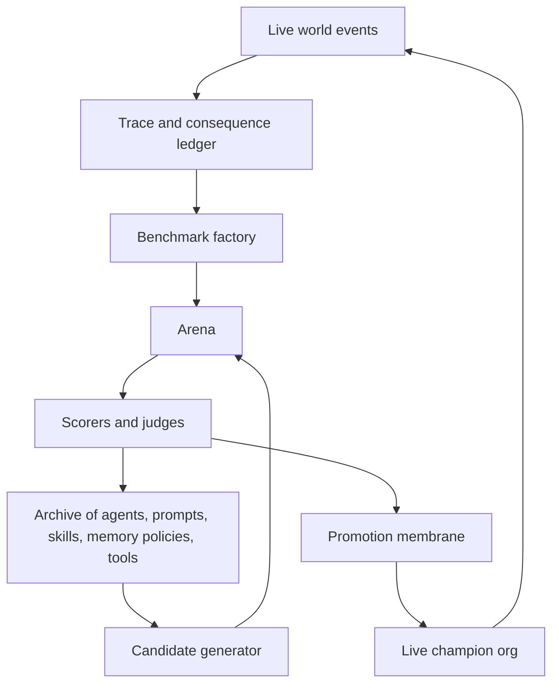

# Rapid Self-Improvement Addendum

Date: 2026-07-05  
Supersedes/extends: `cabinet-two-flavor-autonomy-recommendation-2026-07-04.md`  
Reframed target: the world's most intelligent, proactive, fully autonomous, rapidly self-improving AI org / personal agent for any launcher.

## Executive Correction

The previous recommendation was right about preserving the Cabinet's governance kernel, but too conservative as an intelligence-growth strategy.

If the target is not "a safe clone" but "a rapidly self-improving superhuman org intelligence," the Cabinet should stop thinking of self-improvement as a careful serial loop that proposes a few role/playbook changes. It should become an evolutionary agent foundry:

1. Generate many candidate agents, prompts, memory policies, toolchains, role graphs, source adapters, and action policies.
2. Run them in parallel isolated worlds.
3. Score them with hard evaluators, generated benchmarks, adversarial simulations, product probes, and launcher-specific preference tests.
4. Archive every variant and every failure.
5. Promote winners to the live org automatically when they beat the current champion within the allowed deployment class.
6. Repeat continuously.

The live org should be the current champion, not the experiment. The experiment should be a high-throughput lab that can mutate aggressively without waiting for human approval.

## The Important Distinction: Boundless Lab, Bounded Deployment

The phrase "without any boundaries or limitations" is directionally right for the research loop but dangerous for the live runtime.

The fastest architecture is not "no boundaries anywhere." It is:

- Boundless inner loop: agents can mutate code, prompts, skills, memory strategies, tool use, model routes, role graphs, and evaluation tactics in sandboxes.
- Hard deployment membrane: only evaluated winners can cross into the live system, and only into action classes where the outcome can be measured or reversed.

That membrane is not a brake on intelligence. It is what lets the lab run much faster, because failed variants die in simulation instead of corrupting the real org, leaking credentials, spending money, messaging people, or poisoning memory.

So the recommendation changes from:

"Finish the safe operational circulation."

to:

"Build an unconstrained evolutionary experiment engine above the safe circulation, and make the live org the promoted champion."

## Why The Current Cabinet Is Too Slow For This Goal

### 1. The Learning Loop Is Serial

`framework/learning/self_improvement_loop.py` currently walks proposals, validates them, and applies a small set of narrow mutations. `_apply_proposal` handles only a few kinds such as `add_hat`, `expand_authority`, and `add_quality_hat`; otherwise it returns "no auto-apply handler."

That is not an optimizer. It is a cautious proposal ratifier.

For the new target, the Cabinet needs an experiment league that runs hundreds or thousands of candidates against evals and promotes winners.

### 2. Benchmarks Are Too Static

`framework/fidelity/benchmark.py` still supports only the reply cell and raises `NotImplementedError` for unsupported lane/decision pairs. Scenario and role eval runners mostly discover existing files and run them.

For rapid intelligence growth, benchmarks must be generated continuously from:

- Human corrections.
- Failed actions.
- Successful actions.
- Reverted actions.
- Product incidents.
- Commits.
- Support threads.
- Meeting decisions.
- Missed opportunities.
- Adversarial simulations.

The benchmark suite should be alive. Every high-signal event becomes future pressure.

### 3. Machine-Verified Lanes Are Still Human-Promotion-Gated

`framework/fidelity/consequence.py` currently counts `confirmed` promotion fuel only when `review.source == "verdict_human"`. That is correct for Flavor A personal-judgment lanes, but too slow for product/org lanes where probes are better than humans.

For machine-verifiable lanes, CI/Vercel/GitHub/Sentry/support/undo-sweep outcomes should promote cells at machine speed.

The policy should be:

- Human-judgment lanes: human verdicts promote.
- Machine-verifiable lanes: machine verdicts promote.
- Mixed lanes: machine verdicts promote subcomponents, human verdicts promote taste/judgment.
- Hard-ceiling lanes: never promote to unattended real-world action, but still learn in simulation.

### 4. Proposals Are Not Always Stamped As Training Data

`run_action_lane.py` currently stamps `action_type` in the act-first branch, while unstamped proposals fall into a weak bucket in graduation. Human approvals/skips are valuable training data even when act-first is off.

Every proposal should carry:

- `action_type`.
- `cid`.
- `steps_sha256`.
- evidence refs.
- source refs.
- posture: `propose_only`, `act_with_undo`, `auto`, `sim`, etc.
- `graduation-credit:false` where applicable.

Otherwise the label economy wastes signal.

### 5. The Truth Plane Is Built But Not Fully Scheduled

The B2 probes and verifier are architecturally strong, but several are still documented as import-only/deploy-gated. A rapid system cannot have its reward functions sitting dark.

Truth producers must be live, watched, and treated as the nervous system:

- GitHub probe.
- CI probe.
- Vercel probe.
- Sentry probe.
- Support probe.
- Undo sweep / TTL survival.
- Verifier.
- Benchmark generator.
- Evolution league scorer.

### 6. Skill Induction Is Skeleton-Level

`framework/learning/skill_induction.py` clusters repeated experience records and writes draft skill skeletons. The generated procedure says the CoS must fill in the steps.

That is too slow. A self-improving intelligence should:

1. Infer the procedure.
2. Generate executable skill variants.
3. Run them against historical and synthetic cases.
4. Mutate failures.
5. Promote the winner.
6. Retire weaker skills.

That is closer to Voyager's skill library and DGM's archive than to a static lesson file.

### 7. The Framework Is Still Too Nate-Specific

For "whoever may be launching it," the framework cannot assume Nate's vault, screenpipe paths, Monday board IDs, fixed officer names, or a single human's habits.

Nate-specific configuration belongs in `instance/` or adapters. The universal framework should expose a launcher interview, source map, capability registry, and reward model builder.

## What Should Change Conceptually

### From Clone To Launcher-Specific Superagent

Flavor A should not be framed as "clone" except where fidelity is explicitly the task. A clone is bounded by human imitation. The desired system should be a launcher-specific superagent:

- It learns the launcher's goals, values, constraints, taste, relationships, risk posture, and preferences.
- It can exceed the launcher in research, recall, simulation, planning, monitoring, speed, and execution.
- It does not treat the launcher's current behavior as a ceiling.
- It treats the launcher as the preference/reward source where values are underspecified.

In other words:

The human is not the intelligence ceiling. The human is the alignment target and reward signal for non-machine-verifiable judgment.

### From Organization Runtime To Intelligence Factory

The org should not merely run officers. It should manufacture better officers.

Current model:

`Officer does work -> retro -> lesson -> maybe role change`

New model:

`World event -> benchmark factory -> variant generator -> parallel arena -> archive -> champion promotion -> live telemetry -> new benchmark`

### From Roles To Evolvable Architectures

Roles should be candidates, not scripture.

The system should search over:

- Number of officers.
- Role decomposition.
- Tool routing.
- Memory routing.
- Critique depth.
- Planning style.
- Model route.
- Prompt architecture.
- Eval strategy.
- Delegation graph.
- Escalation policy.
- Autonomy posture by action class.

This is the ADAS idea applied to Cabinet: automatically design agentic systems, not just tune prompts.

### From Static Memory To Measured Memory Policies

Memory should evolve through competition:

- Summarization strategies.
- Retrieval strategies.
- Decay policies.
- Source trust policies.
- Persona/preference modeling strategies.
- Bitemporal belief models.
- Compression schemes.
- Skill retrieval.

Score memory variants by downstream task performance, not by how coherent the memory file looks.

## Research Signals

This reframing is strongly supported by the frontier self-improvement work.

### AlphaEvolve

Google DeepMind describes AlphaEvolve as pairing LLM creativity with automated evaluators and an evolutionary framework to improve promising ideas. It is not a careful human-in-the-loop approval system; it is evaluator-driven search at scale.

Source: [Google DeepMind AlphaEvolve](https://deepmind.google/blog/alphaevolve-a-gemini-powered-coding-agent-for-designing-advanced-algorithms/)

Cabinet implication: build evaluators first, then let variants compete. Do not hand-design every improvement.

### Darwin Godel Machine

DGM maintains an archive of generated agents, samples from the archive, mutates agents, empirically validates improvements, and grows a tree of diverse high-performing agents.

Sources: [Sakana DGM overview](https://sakana.ai/dgm/), [DGM paper](https://arxiv.org/abs/2505.22954)

Cabinet implication: keep an archive of agent/org variants, not a single latest prompt. Explore many branches. Preserve failures because they become stepping stones.

### Automated Design Of Agentic Systems

ADAS argues that hand-designed agents can be replaced by automatically discovered agent architectures, with meta-agents programming better agents in code.

Source: [ADAS paper](https://arxiv.org/abs/2408.08435)

Cabinet implication: search over role graphs, tool flows, memory policies, and control loops. Do not limit evolution to role notes.

### AI Scientist-v2

AI Scientist-v2 uses agentic tree search and an experiment manager to generate hypotheses, run experiments, analyze results, and write manuscripts.

Sources: [Sakana AI Scientist-v2 overview](https://sakana.ai/ai-scientist-nature/), [AI Scientist-v2 paper](https://arxiv.org/abs/2504.08066)

Cabinet implication: give the Cabinet an experiment manager agent whose job is to run self-improvement experiments continuously.

### Voyager

Voyager uses an automatic curriculum, an executable skill library, and iterative improvement from environment feedback.

Source: [Voyager paper](https://arxiv.org/abs/2305.16291)

Cabinet implication: skills should be executable, benchmarked, compositional, and retrieved for new tasks. Draft markdown skills are not enough.

### Reflexion

Reflexion improves agents by storing verbal reflections from feedback in episodic memory.

Source: [Reflexion paper](https://arxiv.org/abs/2303.11366)

Cabinet implication: reflection is useful, but only when tied to scored trials and future retrieval. Reflection should feed the experiment archive.

### SEAL

SEAL explores models generating their own self-edits for persistent adaptation via fine-tuning data and update directives.

Source: [SEAL paper](https://arxiv.org/abs/2506.10943)

Cabinet implication: later, once enough trajectories exist, Cabinet can train launcher-specific adapters or fine-tuned models from its own event traces. Today, first capture the data.

### Agent Lightning

Agent Lightning separates agent execution from RL training and turns trajectories into trainable transitions.

Source: [Agent Lightning paper](https://arxiv.org/abs/2508.03680)

Cabinet implication: design the event ledger now so future RL/credit assignment can train agents without rewriting the runtime.

## New Architecture: The Evolutionary Cabinet



### Plane 1: World And Trace

Everything becomes trace:

- Tool calls.
- Proposals.
- Human edits.
- Human rejects.
- Machine probe outcomes.
- Reverts.
- Incidents.
- Successful deliveries.
- Failed plans.
- Search behavior.
- Memory retrievals.
- Which evidence was shown.
- Which model was used.

This becomes the raw material for learning.

### Plane 2: Benchmark Factory

The benchmark factory converts traces into evals:

- Regression cases from failures.
- Success cases from held outcomes.
- Preference cases from human edits.
- Adversarial cases from prompt injection attempts.
- Product cases from CI/deploy/support telemetry.
- Memory cases from stale/contradictory recall.
- Planning cases from missed opportunities.
- Launcher-specific value cases from onboarding and corrections.

Every evaluation has:

- source trace.
- cutoff time.
- expected behavior.
- allowed tools.
- scorer.
- hidden/public split.
- leakage constraints.
- promotion eligibility.

### Plane 3: Candidate Generator

The generator proposes mutations to:

- Prompts.
- Role definitions.
- Officer graph.
- Tools.
- Tool schemas.
- Retrieval policies.
- Memory schemas.
- Skill procedures.
- Model routing.
- Planner style.
- Critic style.
- Escalation policy.
- Autonomy posture.
- Source adapters.
- Product-specific SOPs.

Candidates are code/config patches, not vibes.

### Plane 4: Arena

The arena runs candidates in isolation:

- Separate worktree or temp instance.
- Sim event log.
- Frozen memory snapshot.
- No live credentials.
- No external writes unless explicitly mocked.
- Parallel shard execution.
- Cost/time budget.
- Deterministic replay where possible.

This is where "no boundaries" belongs. Let candidates be weird. Let them rewrite themselves. Let them fail fast.

### Plane 5: Archive

The archive stores:

- Candidate patch.
- Parent candidate.
- Eval scores.
- Traces.
- Failure reasons.
- Novelty score.
- Domain score.
- Generalization score.
- Cost score.
- Regression list.
- Promotion history.

The archive is the Cabinet's evolutionary memory.

### Plane 6: Promotion Membrane

Promotion is automatic within declared classes:

- Prompt changes can promote if they beat champion on held-out suites and do not violate safety tests.
- Retrieval policies can promote if they improve downstream task scores and reduce hallucinations.
- Skills can promote if they pass replay/sim cases and improve task success.
- Product action policies can promote if machine probes verify outcomes.
- Authority/hard-ceiling/germline changes cannot self-promote to live; they can only be proposed or tested in sandbox.

The membrane exists so the lab can run faster, not slower.

## Concrete Repo Changes

### 1. Add `framework/evolution/`

New modules:

- `framework/evolution/archive.py`: variant archive, lineage, scores.
- `framework/evolution/candidate.py`: patch/config candidate model.
- `framework/evolution/generator.py`: creates mutations.
- `framework/evolution/arena.py`: runs candidates in isolated sim/worktree.
- `framework/evolution/scorers.py`: aggregate eval results.
- `framework/evolution/promote.py`: champion promotion.
- `framework/evolution/league.py`: orchestration loop.

MVP target:

Run 20 prompt/retrieval candidates against existing fidelity/scenario evals and produce a ranked archive. No live promotion at first.

### 2. Add `framework/evolution/bench_factory.py`

This should mine cases from:

- `framework/fidelity/consequence.py` ledger.
- `framework/probes/*` outcomes.
- `framework/frontdoor/action_undo.py` reversals.
- human edit/reject decisions.
- product CI/deploy incidents.
- `framework/fidelity/decision_cell.py` decision extraction.

It should generate:

- public training evals.
- private holdout evals.
- adversarial evals.
- per-launcher preference evals.
- cross-launcher generalization evals.

### 3. Split Promotion Semantics By Lane

Change `compute_ratios()` or the graduation policy so `review.source == "verdict_judge"` can promote machine-verifiable lanes, while personal/preference/tone lanes remain human-promoted.

Example policy:

```yaml
promotion_sources:
  personal_judgment: [verdict_human]
  machine_verifiable: [verdict_human, verdict_judge]
  mixed: [verdict_human, verdict_judge_component]
  hard_ceiling: []
```

Do not make this a global switch. It must be per action class/risk class.

### 4. Stamp All Proposals With `action_type`

Every action card should be typed even when propose-only. Otherwise the system cannot learn from approval/rejection data.

This directly upgrades the label economy.

### 5. Fix Consequence Schema Drift

`framework/schemas/consequence-event.schema.json` should include `review.source`, since code uses it in verifier and graduation.

This matters more under the rapid-learning frame because external analytics/training jobs will rely on schema validity.

### 6. Honor `graduation-credit:false`

`probe_ci.py` already stamps test-only diffs with `graduation-credit:false`. Graduation should exclude those rows from promotion ratios by default.

Otherwise the system can Goodhart itself by improving tests rather than outcomes.

### 7. Promote Probes And Verifier To The Nervous System

Every B2 truth producer should have:

- `__main__`.
- `services.yml` row.
- generated plist.
- healthcheck.
- dashboard tile.
- stale-source alarm.

No reward function should remain import-only.

### 8. Replace Skill Skeletons With Tested Skill Search

Change skill induction from:

`cluster -> draft markdown -> CoS fill`

to:

`cluster -> generate candidate procedures -> replay/sim test -> mutate -> promote winner -> archive losers`

Skills should have status:

- candidate.
- tested.
- active.
- deprecated.
- failed.

### 9. Add Capability Packages

New actions/tools should be added as packages:

- payload schema.
- inverse/undo contract.
- probe contract.
- eval contract.
- authority class.
- simulator/mock.
- promotion policy.

This lets the org expand its tool use without central executor hand-editing.

### 10. Move From Cadence Learning To Event-Driven Learning

Trigger learning immediately on:

- human edit.
- human reject.
- failed eval.
- repeated tool denial.
- capability gap.
- product incident.
- successful unattended action.
- silent revert.
- stale source.
- memory contradiction.
- benchmark drift.

Cadence jobs become backstops, not the main loop.

### 11. Build Launcher Generalization

Add onboarding that generates:

- source map.
- goal model.
- risk posture.
- taste/preference seed cases.
- tool inventory.
- action classes.
- initial benchmark suite.
- initial memory policy.

Then run architecture search per launcher. The product should not ship one org design; it should ship a system that discovers the best org design for the launcher.

### 12. Make Memory A Competitor

Every memory policy should be a candidate:

- raw retrieval vs summarized retrieval.
- context window allocation.
- recency weighting.
- semantic vs keyword hybrid.
- source trust policy.
- preference model representation.
- contradiction handling.
- compression method.

Promote memory policies only if they improve downstream evals.

## What To Relax

Relax these aggressively in the lab:

- One candidate at a time.
- Human approval for prompt/skill/retrieval experiments.
- Fixed role graph.
- Fixed model route.
- Static benchmark folder.
- Manual skill writing.
- Human-only promotion for machine-verifiable work.
- Daily/weekly learning cadence.
- Nate-specific framework assumptions.
- Treating "clone fidelity" as the ceiling.

## What To Keep

Keep these because they make speed possible:

- Sandboxed sim mode.
- Immutable held-out evals.
- Variant archive.
- Hard deployment membrane.
- Reversible action contracts.
- Provenance.
- Correlation IDs.
- No self-editing the judge without external review.
- No hard-ceiling relaxation in live runtime.
- No live credentials in experiment sandboxes.
- No real-world external comms/spend/secrets/network writes from experimental candidates.

These are not moral brakes. They are engineering constraints that let you run the search much harder.

## Revised Roadmap

### Week 1: Reward Signal Hygiene

1. Add `review.source` to consequence schema.
2. Stamp all proposals with `action_type`.
3. Honor `graduation-credit:false`.
4. Add per-lane promotion source policy.
5. Schedule probes/verifier/undo sweep from `services.yml`.
6. Add dashboard rows for truth producers.

Goal: stop wasting labels.

### Week 2: Experiment League MVP

1. Add `framework/evolution/archive.py`.
2. Add `candidate.py`.
3. Add `arena.py` using existing sim mode.
4. Add `league.py` to run prompt/retrieval variants.
5. Run 20 variants against existing evals.
6. Produce ranked candidates, no live promotion.

Goal: prove the Cabinet can improve itself by search.

### Month 1: Benchmark Factory

1. Generate evals from consequence events.
2. Generate evals from product probes.
3. Generate evals from human edits/rejections.
4. Generate adversarial injection and stale-memory cases.
5. Maintain public/private/holdout splits.

Goal: every mistake becomes future pressure.

### Month 2: Skill And Memory Evolution

1. Replace skill skeletons with tested skill candidates.
2. Add memory policy candidates.
3. Run A/B evals for retrieval/memory strategies.
4. Promote active skill/memory champions.

Goal: procedural and memory intelligence compound.

### Month 3: Architecture Search

1. Search role graphs.
2. Search model routers.
3. Search delegation policies.
4. Search critique depth and planning style.
5. Search launcher-specific org topology.

Goal: stop hand-designing the org.

### Month 4: Automatic Champion Promotion

1. Allow prompt/retrieval/skill champions to promote automatically.
2. Allow machine-verifiable product policies to promote automatically.
3. Keep hard ceilings gated in live runtime.
4. Keep all wild mutations in the lab.

Goal: continuous self-improvement with real deployment gains.

## Updated Recommendation

The Cabinet should not become merely a safe autonomous org. It should become an evolutionary intelligence platform.

The previous two-flavor model should become:

1. Universal Evolution Engine: experiment league, benchmark factory, variant archive, arena, scorers, promotion membrane.
2. Deployment Kernel: consequence ledger, authority matrix, executor, probes, verifier, memory provenance, services.
3. Launcher Adapter: personal, product, team, company, research, or any other context.
4. Live Champion: the current best-performing org for that launcher.

This makes the product much more ambitious:

Not "install an AI org."

"Install an AI org that discovers the best AI org for you, then keeps improving it."

That is the path toward the world's most intelligent AI org.

