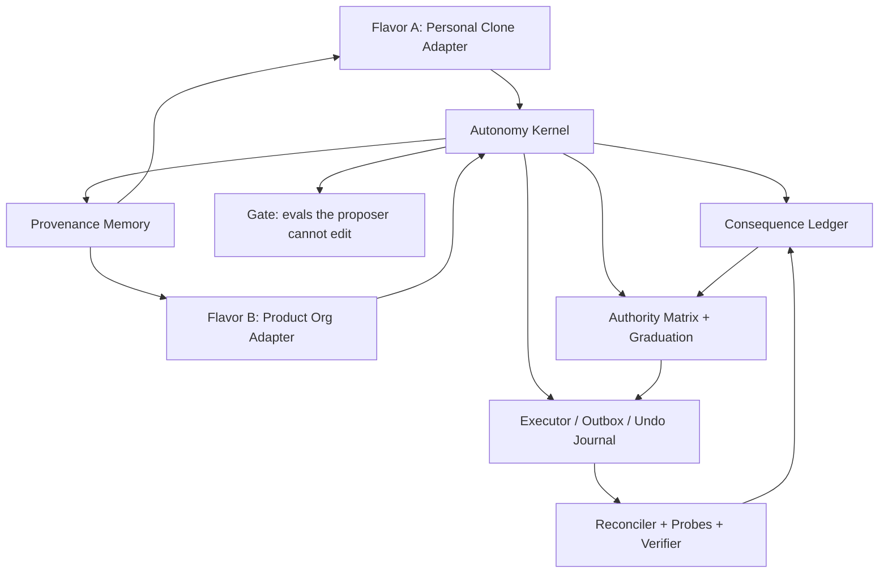

# Cabinet Two-Flavor Autonomy Recommendation

Date: 2026-07-04  
Scope: Captain's Cabinet framework, Flavor A personal clone org, Flavor B standalone product org  
Question: should the Cabinet continue as-is, be restarted, be refactored, or be rebuilt around a new foundation to reach the dream goal of a fully autonomous, self-improving, proactive AI org and personal agent?

## Executive Recommendation

Do not start from scratch.

The Cabinet already has the hard parts that most agent systems never acquire: a real consequence ledger, a hard authority ceiling, per-action-class graduation, mechanical verdict capture, undo-aware execution, probe/verifier design, service-manifest discipline, memory indexing, and a culture of "built means scheduled, fed, watched." A rewrite would mostly destroy operational scar tissue.

But it is not good enough as-is. The architecture is ahead of the runtime. The biggest remaining work is not "make the agents smarter." It is to close the circulation:

1. Every proposal, act, human verdict, machine outcome, undo, revert, and learned rule must flow through one evidence spine.
2. Every scheduled organism must be generated from one manifest and watched by one health model.
3. Every external write must pass through one actuator/outbox/journal contract.
4. Every memory item used for action must carry provenance, time, source, taint, and supersession.
5. Flavor A and Flavor B must share the kernel but not share sensing, credentials, memory stores, ledgers, or runtime assumptions.

The recommended path is a substrate refactor plus adapter extraction:

- Keep: `framework/` governance core, consequence schema, authority matrix, graduation math, binder, action executor, undo journal, probes, verifier, memory worker, fidelity harness.
- Refactor: fleet/runtime control plane, action/outbox duplication, screenpipe leakage, Telegram presentation bypasses, source map/adapters, learning scheduler.
- Build fresh only where needed: Flavor B clean-room deployment, product source adapters, local task board, source map compiler, provenance-aware memory librarian, Gate runner.

This is a "same brain, new circulatory system" moment: preserve the kernel, make the circulation boring, then graduate act-first in narrow reversible lanes.

## Method

This report combines:

- Direct codebase review of `README.md`, `CLAUDE.md`, `docs/plans/*`, `cabinet/services.yml`, `framework/acting`, `framework/frontdoor`, `framework/fidelity`, `framework/probes`, `framework/learning`, launchd scripts, and instance config.
- Four parallel explorer agents:
  - Two-flavor architecture.
  - Runtime autonomy and action policy.
  - Memory, learning, and self-improvement.
  - Codebase quality and refactor/start-over assessment.
- Web research into current agent patterns:
  - OpenAI Agents SDK guardrails, tracing, and human review.
  - Anthropic's multi-agent research system.
  - LangGraph/LangChain long-term memory architecture.
  - MCP and A2A interoperability.
  - Reflexion, Voyager, Generative Agents, Darwin Godel Machine, Magentic-One.

## The Two Flavors

The repo now names the split cleanly in `README.md`: both flavors share the governance core and differ by evidence supply.

| Dimension | Flavor A - Personal clone org | Flavor B - Standalone product org |
|---|---|---|
| Runs on | Daily MacBook | Dedicated Mac Mini |
| Senses | screenpipe capture, personal Obsidian vault, email/Teams-derived memory | Product telemetry: CI, deploys, PRs, error budgets, support, local product board |
| Mission | Act like Nate across commitments, replies, briefings, decisions, coordination | Own one software product end-to-end |
| Ground truth | Human verdicts: approve/edit/skip, corrections, blind quiz picks | Machine probes first: CI, deploys, Sentry, PR state, support resolution |
| Memory gravity | Personal vault and Nate model | Product brain, source map, local task board |
| Fast autonomy classes | Low-blast local/project actions after enough human labels | Machine-verifiable product operations |
| Slow/permanent gates | Voice, judgment, external comms, leadership, legal nuance | Product/legal/commercial judgment, prod deploys, external comms, spend |

The asymmetry is correct. Flavor A cannot honestly "machine verify" whether a reply feels like Nate. Flavor B can machine verify whether CI passed, a deploy held, a support thread stayed closed, or a Sentry burn regressed.

The architectural mistake to avoid is a hybrid: a Mac Mini product org that quietly imports Nate's personal screenpipe estate, or a personal clone that graduates from product probes instead of Nate verdicts.

## Dream Goal Definition

The dream goal is not "agents do everything." It is:

1. Proactive: the system discovers work without being prompted.
2. Autonomous: the system executes increasingly large classes of work without asking, but only where the evidence supports it.
3. Self-improving: the system changes its own prompts, playbooks, skills, and workflows through an eval-gated process it cannot edit.
4. Learning: outcomes, mistakes, edits, reversions, and successful patterns compound into future behavior.
5. Acting: the system can safely mutate real surfaces with provenance, undo, journals, probes, and hard ceilings.
6. Memory-safe: every recalled fact has source, time, provenance, taint, confidence, and supersession.
7. Attention-efficient: the Captain handles only irreducible judgment, not machine-checkable progress.
8. Two-body deployable: personal clone and product org share a kernel but operate cleanly apart.

A good north-star metric is already present: verified outcomes per Captain-minute. For Flavor A, add "clone-fidelity per Captain-minute." For Flavor B, add "machine-held outcomes per Captain-minute."

## Current Autonomy Level

Suggested scale:

| Level | Definition | Cabinet status |
|---|---|---|
| L0 | Manual scripts, no autonomy | Passed |
| L1 | Assistant proposes when asked | Passed |
| L2 | Always-on proactive proposals, approval-gated actions | Mostly live |
| L2.5 | Approved action executor, mechanical labels, scheduled proactive lanes | Current Flavor A runtime |
| L3 | Narrow reversible act-first lanes with undo, canaries, caps, TTL outcome labels | Built/dark or partially live |
| L4 | Machine-verified self-improvement and product operation under Gate | Logic emerging, runtime not live |
| L5 | Multi-product, self-onboarding, self-improving org with hard ceilings intact | Aspirational |

Current assessment:

- Flavor A: L2.5. It has scheduled proactive action proposals, binder verdict capture, approved action execution, memory worker, liveness checks, and action-lane pivot. Act-first is explicitly off by default.
- Flavor B: L2 in code, L1.5 in deployment. The probe/verifier/graduation logic is strong, but probes and verifier are import-only/deploy-gated, and the clean-room Mini/product adapter story is not finished.
- Self-improvement: L2. The loop can generate and apply narrow role/skill changes when invoked, but the trust-bearing eval/gate/scheduler loop is not yet a boring live organism.
- Memory: Flavor A has a strong but sprawling memory substrate. Flavor B's product memory and source map are not yet cleanly born.

## What Is Strong

### Evidence Engine

The core design is excellent. `README.md` describes a single append-only consequence ledger where proposals, approvals, edits, skips, machine outcomes, and demotions join by correlation ID. `framework/fidelity/graduation.py` is a real per-cell state machine: `unmeasured`, `propose_only`, `eligible`, `graduated`, `demote`.

The latest implementation includes:

- Direct-demote on verified fabrication via `demote:direct`.
- Wrong-only recency clock plus 7-day seasoning.
- Bars read from `framework/policies/authority-matrix.yml`, not duplicated.
- Hard ceiling classes that never graduate.

This is the right center of gravity.

### Mechanical Human Verdict Capture

`framework/frontdoor/binder_wire.py` is one of the most important pieces in the repo. The system no longer relies on an agent "remembering" to log the Captain's verdict. The approval surface owns the label capture.

That matches the highest-value production lesson from agent systems: the approval UI is not a sidecar. It is the training label pipe.

### Action Execution And Undo

`framework/frontdoor/action_exec.py` and `framework/frontdoor/action_undo.py` are much more serious than a normal "tool call" layer:

- Payload fingerprint / TOCTOU checks.
- Killswitch in executor.
- Provenance banner.
- Mention stripping.
- Board/cascade gates.
- Write-ahead undo journal.
- 48h undo window.
- Compare-and-restore for updates.
- Archive instead of delete for lane-created Monday items.
- Calendar pinned to a local Cabinet calendar.
- Act-first path downgrades if journaling is unavailable.

That is exactly the kind of low-blast lane required for safe autonomy.

### Probe And Verifier Design

`framework/probes/lib.py` and `framework/probes/verifier.py` implement the right machine-truth pattern:

- Correlation ID joins external artifacts to proposals.
- Unattributable artifacts emit nothing.
- Silent source becomes `unknown`, not false success.
- Verifier compares officer claims against probe logs.
- Fabricated success with reachable probes becomes `wrong` plus direct demote.
- Advisory LLM cannot override deterministic reconciliation.

This is the basis for Flavor B's faster autonomy.

### Hard Ceiling

The hard ceiling is explicit in `framework/policies/authority-matrix.yml`:

- External comms.
- Production deploys.
- Spend.
- Secrets.
- Network writes.
- Credential grants.

Those remain gated regardless of confidence. Keep this forever. It is not a temporary maturity ladder; it is the constitutional boundary.

### Live Ops Culture

The repo has unusually strong operational scar tissue:

- `cabinet/services.yml` encodes "built = scheduled + fed + watched."
- Healthchecks drills exist.
- Ledger liveness exists.
- Memory worker was scheduled and backlog drained.
- CI is live.
- `EXECUTION-STATUS.md` tracks reality rather than merely intent.

That culture is a major reason not to rewrite.

## What Is Not Yet Good Enough

### 1. Built/Dark Boundary Is Still Too Large

The repo has many modules that are built and tested but not scheduled or fully wired:

- B2 probes are import-only and deploy-gated.
- Verifier is built, but live hourly deployment is deferred.
- Probe-to-verifier-to-graduation demotion is closed in logic but inert until scheduled.
- `action_reconcile.py` says it is not yet scheduled in its own docstring, while a separate `com.cabinet.undo-sweep.plist` exists outside `services.yml`.
- `actfirst_canary.py` says canaries/breakers/caps are dark, though parts are consumed by the act-first gate.
- Role evals and self-improvement have templates and scripts, but are not clearly one generated live service.

The issue is not that code is missing. It is that the repo still has too many "nearly alive" organs.

### 2. One Manifest Is Not Yet Actually One Manifest

`cabinet/services.yml` declares itself the fleet manifest. `generate-plists.py` renders daemon/watchdog rows from it. But `deploy-mac.sh` still has a hardcoded daemon list for `--all`, including services not represented in `services.yml`.

That means "what exists" can still diverge between:

- Manifest.
- Generated plists.
- Hand-authored plists.
- LaunchAgents actually installed.
- Deploy script daemon list.
- Verification script expectations.

This is exactly the kind of operational split-brain the project doctrine warns against.

### 3. Two Actuator Stories

There are at least two side-effect stories:

- `framework/frontdoor/action_exec.py`: real approved/action-lane execution with undo journal.
- `framework/outbox/relay.py`: event-ledger transactional outbox with stub adapter, real adapters deferred.

Both ideas are valid, but they should converge. The dream architecture wants one durable outbox/executor contract:

1. Store local intent.
2. Journal the side effect.
3. Execute through a single credential-holding worker.
4. Record artifact IDs.
5. Reconcile outcome.
6. Expose undo.

Until then, future writers will not know whether to queue outbox events or call `deliver_action`.

### 4. Two Enforcement Stories

The authority matrix now includes `act_with_undo` for `pm_write` and `calendar_write`, even when unmeasured. The action-lane act-first path implements this trust-inversion idea with its own gates and flag.

But the typed policy engine, authority matrix, action lane, hook layer, and executor perimeter are not yet one obviously unified enforcement path. This is survivable if documented, but dangerous if operators believe "authority-enforcing" means all action modes read the same verdict semantics.

The key question to settle:

Does `act_with_undo` live in the authority matrix as a verdict consumed by one gate, or is it an action-lane-specific policy bypass with separate config?

Pick one.

### 5. Flavor B Still Leaks Flavor A

Flavor B is supposed to have no screenpipe dependency. The code still has Flavor-A assumptions:

- `framework/acting/screenpipe_adapter.py` imports `~/.screenpipe/pipes`.
- `framework/frontdoor/action_exec.py` loads Monday credentials from `~/.screenpipe/pipes/_shared/.env`.
- `framework/acting/run_action_lane.py` reads `~/Obsidian/screenpipe-brain`.
- Some fidelity and retro paths still default around screenpipe/vault assumptions.
- Setup scripts have historically installed or referenced screenpipe.

This is fine for Flavor A. It is not fine for a clean-room Mac Mini product org.

### 6. Memory Is Powerful But Not Governed Enough

Current memory layers include:

- Screenpipe/Obsidian brain.
- Cabinet Memory pgvector index.
- Tier 2 officer notes.
- Tier 3 experience records — `memory/tier3/experience-records/` (unified 2026-07-04,
  lane/learn-0705: the formerly-separate `memory/experience_records` structured-JSONL
  store and the shell-written `*.md` records now live in this ONE canonical dir, and
  `framework/learning/experience.py list_records()` reads both formats).
- Evolved skills.
- Consequence ledger.
- Org event ledger.
- `.remember/` continuity summaries.

The problem is not lack of memory. The problem is too many memory classes with unclear authority.

The missing pieces are:

- Bitemporal belief model: known_at vs true_for.
- Source map: where did a fact come from, how fresh is it, what replaces it?
- Taint/provenance: generated vs observed vs human-ratified.
- Supersession: when does a newer memory retire an older one?
- Contradiction detection: vault librarian.
- Memory promotion gates: what can enter Tier 1?
- Source offboarding: keep history but stop querying dead sources.

The principle should be: memory can retrieve; only the consequence ledger can authorize autonomy.

### 7. Self-Improvement Is Not Yet Gate-Centered Enough

`framework/learning/self_improvement_loop.py` is ambitious and useful. It can chain evals, pattern detection, role evolution, hat graduation, and skill induction.

But the dream goal requires a stronger Gate:

- The proposer may suggest self-modification.
- The Gate owns the hidden/held-out evals.
- The loop cannot edit its own judge.
- Every accepted change has rollback.
- Every prompt/playbook/skill change has an evidence cluster and counterexample search.
- Production self-changes must be measured after deployment.

Right now, there are evals and golden tests, but the operational status is still "some scripts/templates/optional launchd," not "one undeniable self-improvement circuit."

### 8. Front-Door Bypasses Remain

Some lanes still send Telegram directly instead of going through `framework.frontdoor.channel.send()`. The Chair should be the single human surface. Every presenter should inherit the same:

- Chunking.
- Retry.
- Token scrubbing.
- PID handling.
- Audit trail.
- Future digest/veto semantics.

Direct `_tg()` senders are not fatal, but they are exactly the kind of small bypass that later becomes a missing label or stale proposal.

### 9. Unknown Identity Should Not Be Warn-Allow In Runtime

With Claude Code sessions running high-permission local tools, unknown officer identity should fail closed in runtime. Warn-and-allow can remain for explicit onboarding/dry-run, but not for a live autonomous fleet.

### 10. Attention Budget Is Inconsistent

`cabinet/services.yml` describes an action lane expectation of `<=2 action cards/run, <=5/day`, while `run_action_lane.py` says there is no attention quota and uses `MAX_PER_RUN = 8` as an anti-runaway bound.

Either choice can be defended, but the drift is not harmless. The Captain is a metered resource; the lane should have one explicit attention contract.

## External Research Patterns And What They Mean Here

### Guardrails And Human Review

OpenAI's Agents SDK separates guardrails, approvals, and traces. Guardrails validate input/output/tool behavior; human review pauses sensitive tool calls for approval; tracing makes runs inspectable.

Relevant sources:

- [OpenAI Agents SDK guardrails](https://openai.github.io/openai-agents-python/guardrails/)
- [OpenAI guardrails and human review](https://developers.openai.com/api/docs/guides/agents/guardrails-approvals)
- [OpenAI Agents SDK tracing](https://github.com/openai/openai-agents-python/blob/main/docs/tracing.md)

Cabinet implication: the Cabinet is already aligned conceptually. Its missing piece is not the theory; it is making the guardrail/approval/trace chain singular across all lanes.

### Supervisor/Subagent Research Systems

Anthropic's multi-agent research system uses a lead agent to plan, spawn specialized subagents, and synthesize results, with each subagent independently searching and evaluating sources.

Relevant source:

- [Anthropic: How we built our multi-agent research system](https://www.anthropic.com/engineering/multi-agent-research-system)

Cabinet implication: the CoS/lane-CEO model is sound. The important design lesson is not "spawn more agents"; it is to give the lead agent a durable plan, bounded subtasks, independent context windows, and a synthesis/evaluation pass. That maps cleanly to CoS as orchestrator, lane officers as bounded executors, and verifier/Gate as judge.

### Long-Term Memory

LangGraph/LangChain's memory docs distinguish short-term thread memory from long-term memory namespaces and call out semantic, episodic, and procedural memory.

Relevant sources:

- [LangChain memory overview](https://docs.langchain.com/oss/python/concepts/memory)
- [LangChain memory for agents](https://www.langchain.com/blog/memory-for-agents)

Cabinet implication: the Cabinet already has semantic, episodic, and procedural stores, but not a strong enough namespace/authority model. Add memory governance before adding another memory store.

### Reflexion

Reflexion showed that language agents can improve by storing verbal reflections from trial feedback in episodic memory, without model fine-tuning.

Relevant source:

- [Reflexion: Language Agents with Verbal Reinforcement Learning](https://arxiv.org/abs/2303.11366)

Cabinet implication: the reflection loop is directionally right, but reflections should be linked to action_type, outcome, evidence, and counterexamples. Free-floating lessons should not authorize autonomy.

### Voyager

Voyager combines automatic curriculum, an executable skill library, and iterative code improvement from environment feedback.

Relevant source:

- [Voyager: An Open-Ended Embodied Agent with Large Language Models](https://arxiv.org/abs/2305.16291)

Cabinet implication: the Cabinet's `memory/skills/evolved` should become a real skill library with validation, retrieval, versioning, and deprecation. The curriculum analogue is the mission/outcome generator: propose next work based on evidence gaps, product telemetry, and direction fit.

### Generative Agents

Generative Agents uses observation, memory, reflection, and planning to produce believable behavior over time.

Relevant source:

- [Generative Agents: Interactive Simulacra of Human Behavior](https://arxiv.org/abs/2304.03442)

Cabinet implication: Flavor A needs this architecture more than Flavor B. Believability/fidelity requires not just facts, but reflection and planning against Nate's values, current context, and social state. The clone-fidelity harness should remain separate from product outcome probes.

### Darwin Godel Machine

The Darwin Godel Machine explores self-improving coding agents that modify their own code and empirically validate changes against benchmarks, while using sandboxing and human oversight.

Relevant sources:

- [Darwin Godel Machine paper](https://arxiv.org/abs/2505.22954)
- [Sakana AI DGM overview](https://sakana.ai/dgm/)

Cabinet implication: this is the right inspiration for the Gate. Do not ask agents to prove changes are good in the abstract. Maintain an archive of variants and admit only empirically better changes through held-out evals, regression suites, and rollback. Cabinet should not be a pure DGM, because it operates on real personal/product surfaces, but the empirical-fitness pattern is exactly right.

### Interoperability: MCP And A2A

MCP standardizes connecting agents to tools and data sources; A2A standardizes agent-to-agent communication and capability discovery.

Relevant sources:

- [Model Context Protocol introduction](https://modelcontextprotocol.io/docs/getting-started/intro)
- [MCP specification](https://modelcontextprotocol.io/specification/2025-06-18)
- [Google Agent2Agent announcement](https://developers.googleblog.com/en/a2a-a-new-era-of-agent-interoperability/)
- [A2A GitHub project](https://github.com/a2aproject/A2A)

Cabinet implication: the Source Map should be Cabinet's internal analogue of MCP/A2A discovery: every tool/source/agent exposes capabilities, sensitivity, freshness, owner, adapter methods, and allowed action classes. Do not hardcode board IDs and hidden assumptions into agents.

### Generalist Multi-Agent Systems

Microsoft Magentic-One is a generalist multi-agent system for open-ended web/file tasks.

Relevant sources:

- [Magentic-One docs](https://microsoft.github.io/autogen/stable//user-guide/agentchat-user-guide/magentic-one.html)
- [Microsoft Research Magentic-One article](https://www.microsoft.com/en-us/research/articles/magentic-one-a-generalist-multi-agent-system-for-solving-complex-tasks/)

Cabinet implication: generalist multi-agent systems work best when orchestration, tool use, and task state are explicit. Cabinet's lane/officer model can stay, but the handoffs need a common task protocol and evidence chain.

## Gap Matrix

| Gap | Severity | Why it matters | Recommendation |
|---|---:|---|---|
| Probes/verifier not scheduled | Critical | Flavor B cannot earn machine-truth autonomy while probes are inert | Add services rows, healthchecks, dry/live rollout, and verifier cron |
| Act-first brakes partly dark | Critical | Unattended writes require canaries, caps, reconciliation, silence breaker | Make act-first flag refuse to arm unless brake jobs are fresh |
| Multiple actuator paths | Critical | Future writes may bypass undo/outcome/reconciliation | Merge outbox and `action_exec` into one executor contract |
| Flavor B screenpipe leakage | Critical | Clean-room Mini is not clean-room if framework imports personal sensing | Move all screenpipe/vault paths behind Flavor A adapters |
| Fleet manifest split | High | Services can be "built" but not deployed/watched | Make `services.yml` generate, install, verify, and document all services |
| Memory authority unclear | High | Retrieved generated text can become "truth" | Add provenance/taint/supersession; ledger remains sole autonomy authority |
| Self-improvement scheduler unclear | High | Learning does not compound unless it runs and is watched | One scheduled role-eval -> pattern -> self-improvement -> Gate path |
| Telegram bypasses | High | Missing labels and inconsistent human UX | Route all Captain-facing messages through `frontdoor.channel` |
| Unknown officer warn-allow | High | Identity ambiguity plus high-permission tools is exposure | Fail closed in runtime; explicit onboarding mode only |
| Attention quota drift | Medium | Captain attention is the core budget | Pick one quota model and enforce/report it |
| Approved-path journaling best-effort | Medium | Cards advertising undo may lack undo if journal failed | For undo-advertised approved actions, fail closed on journal failure |
| Experience record split | Medium | Learning loop may miss lessons | Consolidate JSONL and markdown experience records or index both |
| Local-vs-product task model unfinished | Medium | Flavor B still leans toward Monday/external PM | Land local task board and optional PM adapter |
| Source map absent | Medium | New tools require manual hidden knowledge | Build `instance/config/sources/*.yml` discovery/classification/compiler |

## The Architecture To Aim For

Use one shared Autonomy Kernel with two evidence adapters.

Kernel owns:

- Consequence schema.
- Correlation IDs.
- Authority matrix.
- Graduation state.
- Hard ceiling.
- Binder/verdict protocol.
- Executor/outbox contract.
- Undo journal.
- Probe/verifier framework.
- Gate runner.
- Memory provenance schema.
- Service manifest compiler.

Flavor A adapter owns:

- Screenpipe/vault reads.
- Nate-model/personality/fidelity harness.
- Human verdict label supply.
- Personal commitments/replies/briefs.
- Personal source map.

Flavor B adapter owns:

- Product repo telemetry.
- Local task board.
- CI/GitHub/Vercel/Sentry/support probes.
- Product brain.
- Machine outcome label supply.
- Clean-room credentials and executor identity.

## Recommended Roadmap

### Phase 0 - Stabilize The Truth Surface

Goal: make reality inspectable.

1. Make `cabinet/services.yml` the only fleet contract.
2. Generate install, verify, and docs from it.
3. Add `services doctor`: declared vs generated vs installed vs firing vs healthchecks.
4. Move hand-authored plists like undo-sweep/canary into services or explicitly mark them experimental.
5. Update `EXECUTION-STATUS.md` whenever a built/dark module becomes live.

Exit: one command answers "what is actually alive?"

### Phase 1 - Close Evidence Circulation

Goal: labels flow for both humans and machines.

1. Route all Captain-facing sends through `frontdoor.channel`.
2. Ensure every action card has `action_type`, `cid`, `steps_sha256`, evidence refs, and source refs.
3. Schedule B2 probes and verifier in shadow first.
4. Make verifier/drill status visible in dashboard.
5. Schedule undo/reconcile from the manifest.
6. Add stale-evidence alarms: no labels, no probes, no verifier, no reconcile.

Exit: proposal -> verdict -> action -> outcome -> review -> graduation is observable end-to-end.

### Phase 2 - Consolidate Acting

Goal: one way to mutate the world.

1. Decide whether `action_exec` absorbs `outbox.relay`, or outbox becomes the front door to `action_exec`.
2. Require journal-before-mutation for any action advertising undo.
3. Move credentials to a dedicated executor identity for Flavor B.
4. Add mandatory artifact ID capture for every write.
5. Make act-first impossible unless reconciler, canary, caps, and veto registry are fresh.

Exit: all writes pass through one journaled actuator.

### Phase 3 - Build The Adapter Boundary

Goal: Flavor B can boot without Flavor A.

1. Introduce `framework/sources/` interfaces:
   - `observe`.
   - `search`.
   - `propose`.
   - `act`.
   - `invert`.
   - `probe`.
2. Move `screenpipe_adapter.py` under Flavor A or wrap it as a personal source adapter.
3. Remove `~/.screenpipe` and `~/Obsidian/screenpipe-brain` defaults from framework code.
4. Add product adapters for GitHub, Vercel, Sentry, CI, support, local board.
5. Add source map discovery: `instance/config/sources/<tool>.yml`.

Exit: framework tests pass with no screenpipe/vault present.

### Phase 4 - Make Memory Governed

Goal: memory becomes reliable enough to act from.

1. Add a memory envelope to every indexed item:
   - source.
   - source_id.
   - observed_at/content_ts.
   - ingested_at.
   - generated_or_observed.
   - human_ratified.
   - confidence.
   - supersedes.
   - taint flags.
2. Add vault librarian:
   - dedup.
   - contradiction detection.
   - stale source flags.
   - source offboarding.
3. Consolidate experience records.
4. Add memory promotion policy for Tier 1.
5. Make memory retrieval cite source/time in every action proposal.

Exit: no durable memory can silently become authority.

### Phase 5 - Make Self-Improvement Gate-Centered

Goal: learning compounds safely.

1. Install one visible learning loop:
   - role evals.
   - pattern detection.
   - proposal generation.
   - Gate.
   - apply.
   - post-apply measurement.
2. Gate owns hidden/held-out evals.
3. Every change gets:
   - evidence cluster.
   - counterexample search.
   - rollback path.
   - owner.
   - expiry/review date.
4. Build an archive of variants, inspired by DGM, but constrained:
   - no self-editing Gate.
   - no hidden permission expansion.
   - no hard-ceiling relaxation.
5. Make evolved skills a versioned skill library, inspired by Voyager:
   - status: draft, validated, active, deprecated.
   - retrieval metadata.
   - eval coverage.

Exit: the Cabinet can improve prompts/playbooks/skills without relying on vibes.

### Phase 6 - Graduate Narrow Act-First

Goal: earn real unattended action.

Start with only:

- Local task creation on a non-cascade board/local board.
- Local task status moves.
- Local Cabinet calendar events.
- Tier 2 note creation.
- Investigation/read-only brief dispatch.

Do not start with:

- External comms.
- Production deploys.
- Spend.
- Secrets.
- Network writes.
- Credential grants.
- Anything that cascades to colleagues.

Act-first requirements:

1. Fresh canary.
2. Fresh undo sweep.
3. Fresh verifier/probes if machine-verifiable.
4. No active veto.
5. Kind not frozen.
6. Silence breaker clear.
7. Daily cap clear.
8. CID echo suppression live.
9. Human digest includes acted items.
10. Revert-rate under threshold.

Exit: at least one reversible lane acts for 30 days with low reversal rate and no hard-ceiling breach.

### Phase 7 - Clean-Room Flavor B

Goal: product org exists as a real second body.

1. Fresh ledger.
2. No inherited personal memory.
3. No screenpipe import.
4. Product source map generated.
5. Local board canonical.
6. PM adapters optional mirrors only.
7. Product probes scheduled.
8. Dedicated executor user.
9. 72h soak.
10. First product lane graduates only from machine probes.

Exit: Mac Mini can operate one product with no personal sensing stack.

## What To Kill Or Defer

Kill or defer:

- Any third memory layer that lacks provenance.
- Any "agent says it is done" path that bypasses probes/verifier.
- Any automatic source sync without source map classification.
- Any act-first lane without undo/reconcile/canary freshness.
- Any Flavor B path that imports screenpipe by default.
- Any self-improvement that can edit its own Gate.
- Any attempt to maximize automation percentage instead of verified outcomes per Captain-minute.

## Dashboard Needed

The dashboard should not be a governance editor. It should be an instrument panel:

1. Evidence browser: proposal -> decision -> action -> outcome -> review.
2. Autonomy map: cells by officer/lane/action_type/state.
3. Captain debt queue: pending decisions, oldest age, expiry risk.
4. Fleet: services declared/generated/installed/firing/healthy.
5. Probe health: source freshness, unknown rate, unattributable CIDs.
6. Act-first: acts/day, undo rate, silent reverts, canary status, frozen kinds.
7. Learning: eval failures, proposed changes, Gate pass/fail, applied changes, rollback.
8. Memory: ingestion lag, unprovenanced items, stale sources, contradictions.

## Final Verdict

The Cabinet is not a toy, and it should not be restarted.

It is also not yet the dream. It is a strong autonomy kernel surrounded by a still-converging runtime substrate. The next move is a disciplined refactor:

- Make the spine singular.
- Make dark machinery live or delete it.
- Make Flavor B truly clean-room.
- Make memory provenance-bearing.
- Make self-improvement Gate-centered.
- Let only narrow reversible lanes act first.

The strongest strategic bet is:

One shared governance kernel. Two separate bodies. Evidence first. Memory retrieves; the ledger authorizes. Probes verify; the Gate admits change. The Captain's attention becomes the scarce resource the whole org optimizes around.

