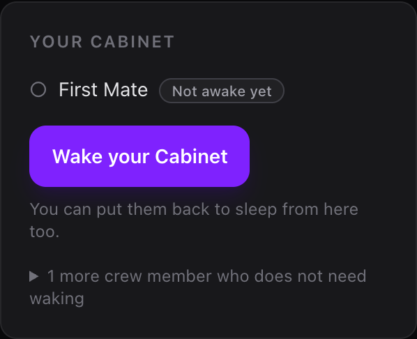
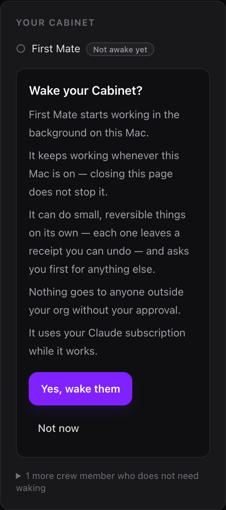
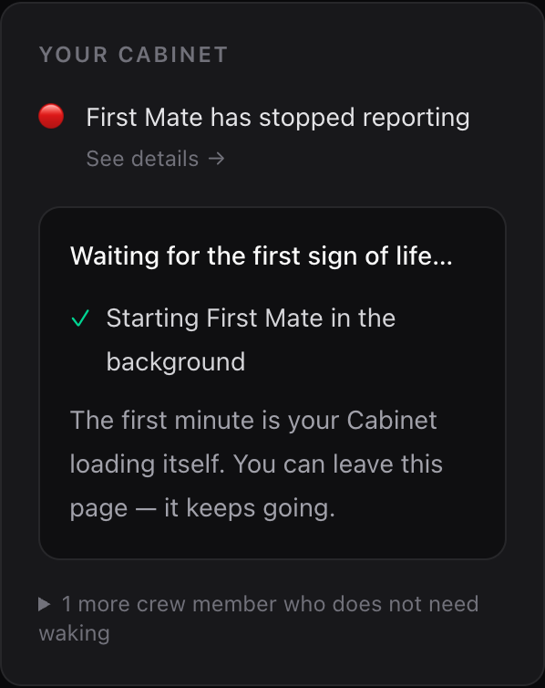
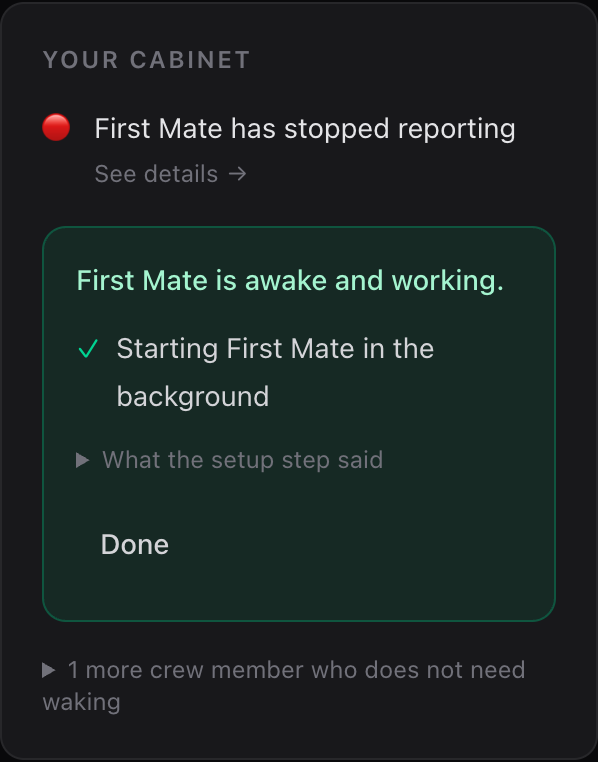
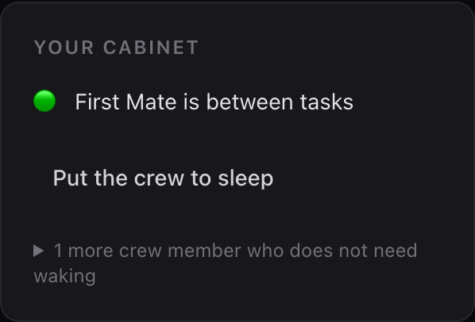
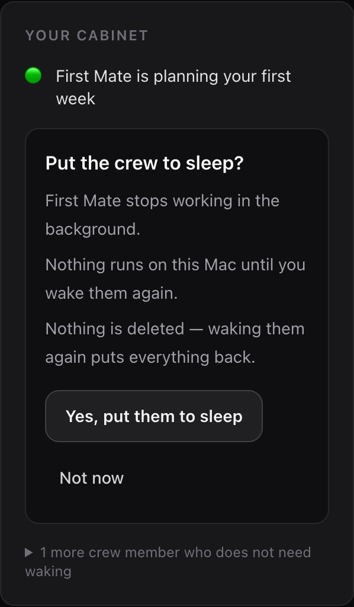
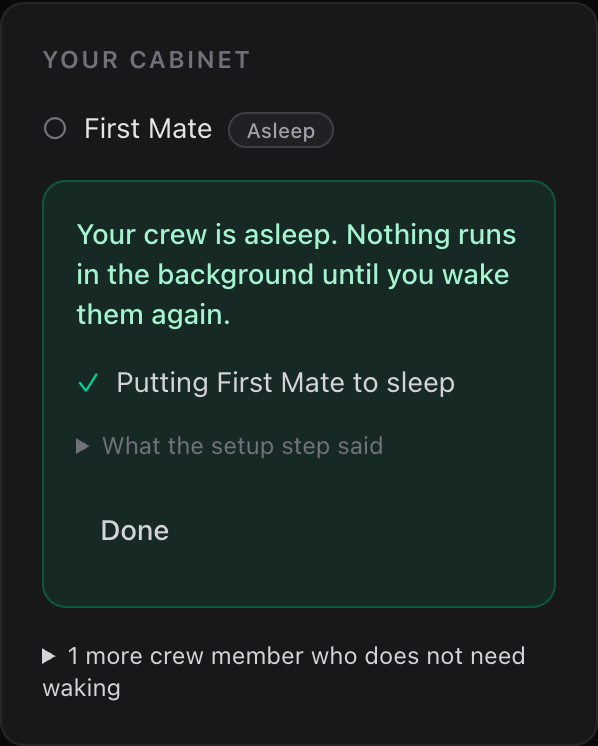

# Wake your Cabinet — one honest click, reversible

2026-08-14. What a freshly hatched operator saw, what was wrong with it, and
what replaced it. Screenshots are from a live drive of the shipping code, not
mockups; the drive is described at the bottom.

## The report

A fresh instance, no officer ever started, home page:

> 🔴 First Mate is offline · See details
> 🔴 Hired Lane Ceo is offline · See details

Two separate defects in two lines.

## D1 — never-started is not an alarm

Red plus "offline" means BROKEN to a human. Nothing was broken: `hatch.sh`
stops short of launchd by default (`--no-launchd` is the v0 default), so on a
brand-new cabinet **nobody has ever started an officer**. "Offline" is the
right word for an officer that ran and died. It is the wrong word for one that
has never been asked to start.

**Why the heartbeat alone cannot tell them apart.** `start-officer-mac.sh`
writes `cabinet:heartbeat:<slug>` with `SETEX … 900`, so a dead officer's
heartbeat key VANISHES fifteen minutes after it dies. From that moment a
crashed officer and a never-existing one are byte-identical in the store. Any
rule derived from the heartbeat alone must alarm about both or reassure about
both; the card chose to alarm.

**The second signal**, which `cabinet-doctor.sh` already asks: is the officer's
LaunchAgent INSTALLED (`~/Library/LaunchAgents/com.cabinet.officer.<slug>.plist`)?
That file exists if and only if somebody ran the move-in for that officer on
that Mac. It is exactly what the wake flow creates and what
`deploy-mac.sh --stop` deliberately leaves behind.

Six states now, where there were two (`cabinet/dashboard/src/lib/crew.ts`):

| state | when | how it reads |
|---|---|---|
| `awake` | fresh heartbeat | 🟢 what it is doing |
| `not-awake-yet` | no heartbeat, no installed helper | ○ `Not awake yet` — calm, no colour |
| `resting` | stopped on purpose, no beat since | ○ `Asleep` — calm |
| `on-call` | roster `type: consultant`, not reporting right now | ○ `On call` — calm, folded |
| `quiet` | helper installed / beat went stale, nothing reporting | 🔴 has stopped reporting |
| `stop-failed` | asked to stop, still beating | 🔴 the other alarm |
| `unknown` | a reading could not be taken | ❓ with the reason |

The ORDER is part of the argument. `on-call` is answered above the staleness
arm, because a consultant is spawned per trigger and stops when the mission
ends — its heartbeat going stale is the normal end of a mission, not a death,
and it has no keepalive job to have failed. Below that arm, every completed
consultant mission became a red alarm fifteen minutes later.

The degenerate end is its own answer: an install reading that could not be
taken does **not** buy the calm state. It cannot distinguish the two cases
either, so it says `unknown` and says why. A sensor that fails toward
reassurance is the bug one direction over from the one being fixed.

## D2 — "Hired Lane Ceo" was a slug wearing a person's name

A portfolio hatch generates a lane CEO for the placeholder lane the operator
never renamed. Two things were wrong with the line:

1. **The name.** `officerTitle()` fell straight through to `titleCaseSlug()`,
   so a machine id was title-cased and printed where a person's name goes. The
   words already existed on disk: `roster.yml` carries `title: First Lane CEO`
   (the operator's own answers produced it) and
   `contexts/<lane>.yml` carries the lane's display name. Nothing was missing;
   nothing was being read. The resolver now goes: framework title → roster
   title → **the officer's LANE name plus its job word** → Title Case.
2. **The alarm.** A lane CEO is a `type: consultant` — an on-demand session with
   no keepalive job at all, which `cabinet-doctor.sh` already SKIPs rather than
   calls dead. It now sits under a fold: *"1 more crew member who does not need
   waking"*. The fold rule names no lane, slug or product — it is structural
   (on-demand, or generated but never hired) — and it never hides anything that
   is working or wrong.

## The wake flow

One primary action on the card. The full cycle, live:

| | |
|---|---|
|  | **Never started.** A quiet neutral chip and one primary action. No red, no "offline", no "See details" on a non-event. |
|  | **Consent, in place.** What starts, where it runs, what it may do without asking (the REAL posture, read through `cabinet/scripts/posture-status.py` — the same resolver the runtime obeys), what always needs the operator, and the cost. |
|  | **Progress, in plain words.** One step per officer, then an honest wait. "Started" is a claim about a command; "awake" is a measurement. |
|  | **The proof.** The flow polls `/api/crew` until the officer's own state changes, and the chip above it flips live. |
|  | **After.** The card shows the live state, and the undo is right there. |
|  | **Reversible from the same screen.** Nothing is deleted; waking again puts everything back. |
|  | **Slept.** |
|  | **Back to the offer.** `Asleep` is calm, not an alarm — and the card does not claim a stopped officer is working. |

### What it is allowed to run

`cabinet/dashboard/src/lib/crew-ops.ts` is a **closed table of two argv
shapes**, and it is the only thing in the app that can reach launchd:

```
wake   →  bash <root>/cabinet/scripts/deploy-mac.sh --officer <slug>
sleep  →  bash <root>/cabinet/scripts/deploy-mac.sh --stop    <slug>
```

- `execFile` with an **argv array**, never a shell and never a template string,
  so nothing a caller passes can become a new word, a pipe or a second command.
- The script path is derived from the checkout root, never from input.
- The one interpolated value is the officer slug, which comes from this
  deployment's own `roster.yml` and is re-validated at the door against
  `^[a-z0-9][a-z0-9-]{0,63}$` plus a reserved-word list.
- **Why the leading character class is its own rule:** `^[a-z0-9-]+$` (the first
  version) accepts `--force`, `--all` and `-officer`, because a hyphen is a legal
  slug character and nothing said it could not lead. Its own adversarial test
  caught it. `all` is `deploy-mac.sh`'s wildcard for both legs — `--stop all`
  boots out every installed `com.cabinet.*` LaunchAgent, the dashboard serving
  the page included — so it is reserved by name.
- Not `dockerExec`: that is a generic `bash -c <string>` transport, and every
  property above would be lost by reaching the same scripts through it.

`deploy-mac.sh` is reused rather than reimplemented because it owns the atomic
plist install, the bootout-first idiom that makes a repeat press a redeploy
instead of `Bootstrap failed: 5`, the per-service rollback and the consultant
guard.

### What it refuses, before anything runs

Unauthenticated (a Server Action is a POST endpoint; middleware never covers
action dispatch) · onboarding incomplete · no store configured (a wake this
process cannot then observe is a dead end) · an empty roster (guessing a fleet
is the wrong-fleet-deploy failure `deploy-mac.sh` refuses for the same reason).

### Scope, stated

The wake starts the **always-on officers**. It deliberately does not run the
rest of hatch's move-in (`generate-plists.py` + loading the generated fleet):
that would bootstrap `com.cabinet.dashboard` against the dashboard already
serving the page, and it would park any `com.cabinet.*` job outside the
manifest. Wiring the background schedule is a separate, larger step and is not
claimed anywhere in this flow's copy.

## Two things found while driving it

**The heartbeat format disagreed with itself.** `cabinet:heartbeat:<slug>` has
four writers. Three stamped ISO-8601; `start-officer-mac.sh` — the one that runs
FIRST, at officer boot — stamped Unix seconds. No shell reader noticed (they all
test presence and let the TTL do the freshness work), but the dashboard parses
the value, and `Date.parse("1786719742")` is `NaN` → the `unknown` arm. So for
the minutes between an officer's own boot stamp and the supervisor's first
refresh, a healthy just-started officer rendered as **"heartbeat unreadable"** in
amber — on exactly the screen an operator watches after pressing this button.
Fixed at the writer; pinned by `cabinet/scripts/tests/test_heartbeat_stamp_format.py`,
which discovers the writers by grep and asserts what each one PRODUCES parses,
and which was verified red against the pre-change tree.

**The sleep button lied for fifteen minutes.** The first drive produced a
screenshot with `🟢 First Mate is planning your first week` directly above `Your
crew is asleep` — because the heartbeat is `SETEX 900` and outlives a successful
stop. Ranking the stop marker above the heartbeat instead would have resurrected
the defect `actions/officers.ts` is written about (a card reading "stopped" over
an agent still running and still acting). Neither ordering is right, because
they answer different questions: the sleep now records WHEN it was requested, a
beat older than that is a leftover (`resting`), and a beat newer than it means
the stop did not take (`stop-failed`, an alarm). An unrecorded or unparseable
stop time takes the conservative arm.

## How the screenshots were made

A private headless Chrome against a dev server running **the shipping code** with
scratch surroundings: a scratch instance (`roster.yml`, lane contexts, ratified
onboarding state), a scratch Redis on port 6399, a scratch `HOME`, and a
scratch `CABINET_ROOT` copy whose `start-officer-mac.sh` is a stub that stamps
the heartbeat exactly as the real one does — so no Claude session, no live store
and no live tmux was involved. The roster slug is deliberately distinct, so the
launchd label (`com.cabinet.officer.first-mate`) cannot collide with a live one.
Every server action, `deploy-mac.sh` invocation, plist install, `launchctl
bootstrap`/`bootout` and status poll in those frames is real.

A separate end-to-end proof exercised the launchd mechanics with the real
`deploy-mac.sh` under a unique label (`com.cabinet.officer.wakeproof`): plist
installed, job bootstrapped and running with a pid, tmux session created, a
second wake redeployed cleanly (no `Bootstrap failed: 5`, still exactly one
job), `--stop` booted it out with absence asserted, a second stop returned
success, and the machine's 52 live `com.cabinet.*` jobs were byte-identical
before and after.
